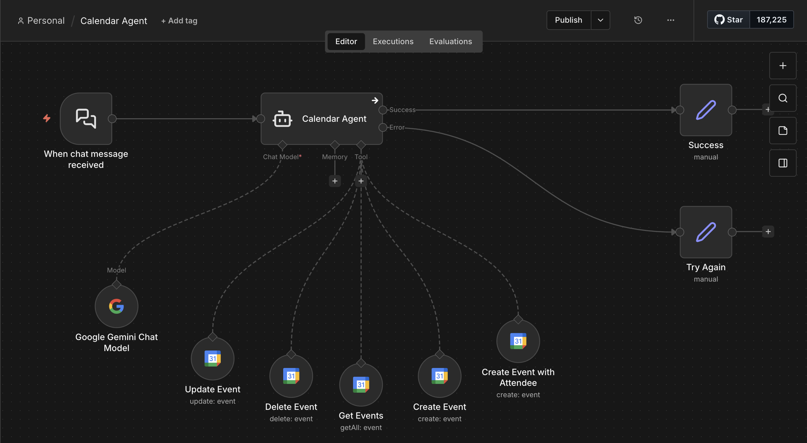

# AI Calendar Agent Automation

## Overview
The AI Calendar Agent Automation is an intelligent scheduling and calendar management assistant built using n8n and Google Gemini AI. The workflow enables users to manage calendar operations through natural language conversations, allowing them to create, update, retrieve, and delete calendar events automatically.

The system integrates conversational AI with Google Calendar services to automate scheduling tasks, simplify event management, and improve productivity through intelligent calendar handling.

---

# Workflow Architecture

## Workflow Screenshot

---

# Objective

The primary objective of this workflow is to:
- Automate calendar management
- Enable AI-powered scheduling assistance
- Simplify event creation and updates
- Manage meetings using natural language
- Improve productivity and scheduling efficiency
- Reduce manual calendar handling effort

---

# Technologies & Tools Used

| Tool / Service | Purpose |
|---|---|
| n8n | Workflow automation platform |
| Google Gemini AI | Conversational AI processing |
| Google Calendar API | Calendar event management |
| AI Agent Node | Intelligent scheduling assistant |
| Google Calendar Tools | Event creation, update, deletion, and retrieval |

---

# Workflow Explanation

## 1. Chat Message Trigger
The workflow begins whenever a user sends a message to the Calendar Agent.

### Purpose
- Capture user scheduling requests
- Start conversational calendar management flow
- Trigger AI processing

### Example Requests
- "Schedule a meeting tomorrow at 4 PM"
- "Delete my Friday meeting"
- "Show my upcoming events"
- "Update the project meeting timing"

---

## 2. Calendar Agent
The Calendar Agent acts as the central AI-powered scheduling assistant.

### Responsibilities
- Understand natural language scheduling requests
- Determine required calendar action
- Use appropriate Google Calendar tools
- Handle event management operations
- Generate conversational responses

### Capabilities
- Event creation
- Event updating
- Event deletion
- Event retrieval
- Attendee management

---

## 3. Google Gemini Chat Model
Google Gemini AI powers the natural language understanding and conversational intelligence of the workflow.

### AI Functions
- Intent recognition
- Date and time understanding
- Event detail extraction
- Conversational response generation
- Smart scheduling interpretation

### Purpose
- Enable human-like scheduling interaction
- Simplify calendar management through AI

---

# Integrated Calendar Tools

## 4. Create Event Tool

### Function
Creates new Google Calendar events automatically.

### Purpose
- Schedule meetings
- Create reminders
- Add appointments to calendar

### Event Information Includes
- Event title
- Date and time
- Description
- Location
- Meeting duration

### Example
User request:
> "Create a meeting with the design team tomorrow at 3 PM"

---

## 5. Create Event with Attendee Tool

### Function
Creates calendar events and automatically adds attendees.

### Purpose
- Schedule collaborative meetings
- Send meeting invitations automatically

### Features
- Invite participants
- Share meeting details
- Automate team scheduling

### Example
User request:
> "Schedule a client meeting with john@example.com on Monday"

---

## 6. Get Events Tool

### Function
Retrieves calendar events from Google Calendar.

### Purpose
- Show upcoming meetings
- Display schedules
- Check availability

### Example Queries
- "What meetings do I have tomorrow?"
- "Show my calendar for next week"

---

## 7. Update Event Tool

### Function
Updates existing calendar events.

### Purpose
- Modify meeting details
- Change schedules
- Reschedule appointments

### Supported Updates
- Date changes
- Time modifications
- Attendee updates
- Description edits

### Example
User request:
> "Move tomorrow’s meeting to 5 PM"

---

## 8. Delete Event Tool

### Function
Deletes calendar events automatically.

### Purpose
- Cancel meetings
- Remove outdated appointments
- Clean schedules

### Example
User request:
> "Cancel my Friday interview meeting"

---

# Workflow Process

## User Interaction Flow

### Step 1
User sends scheduling request.

### Step 2
Calendar Agent processes request using Gemini AI.

### Step 3
AI determines required calendar action.

### Step 4
Appropriate Google Calendar tool executes operation.

### Step 5
Workflow returns success or error response.

---

# Success and Error Handling

## Success Node

### Purpose
Handles successful calendar operations.

### Examples
- Event created successfully
- Meeting updated successfully
- Event deleted successfully

---

## Try Again Node

### Purpose
Handles workflow errors or invalid requests.

### Examples
- Invalid date format
- Missing event details
- Calendar API issues

### Benefits
- Improves workflow reliability
- Provides user-friendly retry handling

---

# Key Features

- AI-powered calendar assistant
- Natural language scheduling
- Automated event creation
- Event updating and deletion
- Attendee management
- Smart schedule retrieval
- Conversational AI interaction
- Google Calendar integration
- Productivity automation
- Intelligent scheduling support

---

# Business Benefits

## Increased Productivity
Reduces time spent managing schedules manually.

## Simplified Scheduling
Users interact using natural language instead of manual calendar operations.

## Automation
Automates repetitive calendar management tasks.

## Collaboration
Simplifies attendee invitations and meeting coordination.

## Smart Assistance
AI improves scheduling efficiency and user experience.

---

# Example Use Cases

## Meeting Creation
User:
> "Schedule a project meeting tomorrow at 2 PM"

AI creates event automatically.

---

## Event Update
User:
> "Reschedule my interview to Friday evening"

AI updates existing calendar event.

---

## Event Retrieval
User:
> "What meetings do I have today?"

AI retrieves upcoming calendar events.

---

## Event Deletion
User:
> "Delete my dentist appointment"

AI removes event from calendar.

---

# Workflow File

Download the exported n8n workflow JSON file below:

[Download Workflow JSON](workflow.json)

---

# Future Improvements

- Zoom/Google Meet integration
- Email reminder automation
- Recurring meeting support
- Time-zone handling
- Voice-based scheduling
- WhatsApp calendar assistant
- Team availability optimization
- AI-based meeting recommendations

---

# Conclusion

The AI Calendar Agent Automation demonstrates how conversational AI and workflow automation can simplify scheduling and calendar management. By integrating Google Gemini AI with Google Calendar services, the workflow enables intelligent event handling through natural language interactions, improving productivity, reducing manual effort, and streamlining calendar operations.
