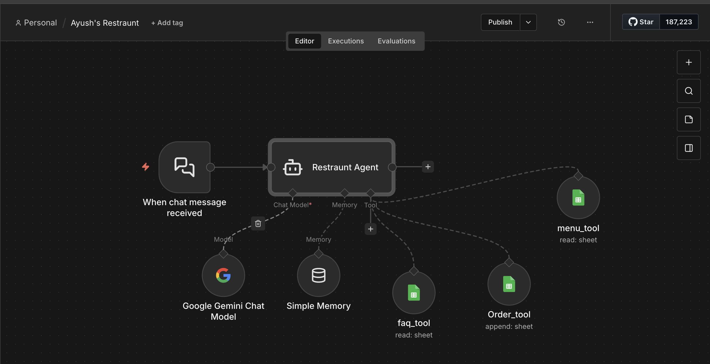

# AI Restaurant Agent Automation

## Overview
The AI Restaurant Agent Automation is an intelligent conversational restaurant assistant built using n8n and Google Gemini AI. The workflow enables customers to interact with a restaurant chatbot that can answer menu-related queries, provide restaurant FAQs, remember conversation context, and place customer orders automatically.

The workflow integrates AI-powered chat processing with Google Sheets-based tools to create an automated restaurant management and customer interaction system.

---

# Workflow Architecture

## Workflow Screenshot

---

# Objective

The primary objective of this workflow is to:
- Automate restaurant customer interactions
- Provide AI-powered menu assistance
- Handle frequently asked customer questions
- Enable automated food order placement
- Improve customer experience
- Reduce manual restaurant support workload

---

# Technologies & Tools Used

| Tool / Service | Purpose |
|---|---|
| n8n | Workflow automation platform |
| Google Gemini AI | Conversational AI processing |
| Google Sheets | Menu, FAQ, and order database |
| AI Agent Node | Intelligent customer interaction |
| Simple Memory | Conversation memory handling |

---

# Workflow Explanation

## 1. Chat Message Trigger
The workflow begins whenever a customer sends a message to the restaurant chatbot.

### Purpose
- Start AI conversation flow
- Capture customer requests
- Initiate restaurant assistant interaction

---

## 2. Restaurant Agent
The Restaurant Agent acts as the central AI-powered conversational assistant.

### Responsibilities
- Understand customer messages
- Process restaurant-related queries
- Use tools dynamically
- Provide intelligent responses
- Handle order-related conversations

### Capabilities
- Menu recommendations
- Food information
- Order placement assistance
- FAQ answering
- Conversation handling

---

## 3. Google Gemini Chat Model
Google Gemini AI powers the natural language understanding and response generation.

### AI Functions
- Customer intent detection
- Conversational response generation
- Menu understanding
- Recommendation generation

### Purpose
- Enable intelligent chatbot interactions
- Improve customer communication quality

---

## 4. Simple Memory
The memory component stores conversation context during interactions.

### Purpose
- Maintain conversation continuity
- Remember previous customer queries
- Enable contextual responses

### Example
If a customer asks:
> "What desserts do you have?"

and later asks:
> "Which one is most popular?"

the AI remembers the previous discussion context.

---

# Integrated Tools

## 5. Menu Tool

### Function
Reads restaurant menu data from Google Sheets.

### Purpose
- Provide menu details
- Share food items and pricing
- Enable AI-based menu recommendations

### Example Queries
- "Show me pizza options"
- "What beverages are available?"
- "Do you have vegetarian food?"

---

## 6. FAQ Tool

### Function
Retrieves restaurant FAQ information from Google Sheets.

### Purpose
- Answer customer questions automatically
- Reduce repetitive support requests

### Supported Questions
- Opening hours
- Delivery availability
- Payment methods
- Reservation information
- Restaurant policies

---

## 7. Order Tool

### Function
Stores customer orders directly into Google Sheets.

### Purpose
- Automate order collection
- Record customer orders
- Maintain order tracking database

### Stored Information
- Customer order details
- Food items
- Quantity
- Special instructions

---

# Workflow Process

## Customer Interaction Flow

### Step 1
Customer sends message to chatbot.

### Step 2
Restaurant Agent processes the request using Gemini AI.

### Step 3
The AI determines which tool is needed:
- Menu Tool
- FAQ Tool
- Order Tool

### Step 4
Tool retrieves or stores information.

### Step 5
AI generates response and sends it back to customer.

---

# Key Features

- AI-powered restaurant chatbot
- Automated menu assistance
- FAQ automation
- Intelligent food recommendations
- Conversational memory handling
- Automated order placement
- Google Sheets integration
- Real-time customer interaction
- Scalable restaurant support system

---

# Business Benefits

## Improved Customer Experience
Customers receive instant responses and assistance.

## Reduced Manual Work
Automates repetitive customer support tasks.

## Faster Order Handling
Orders are recorded automatically without manual intervention.

## Smart Recommendations
AI provides intelligent food suggestions to customers.

## Scalability
Can handle multiple customer conversations simultaneously.

---

# Example Use Cases

## Menu Inquiry
Customer asks:
> "What pasta dishes do you have?"

AI retrieves menu details using Menu Tool.

---

## FAQ Handling
Customer asks:
> "What time does the restaurant close?"

AI retrieves answer using FAQ Tool.

---

## Food Ordering
Customer says:
> "I want 2 burgers and 1 cold coffee."

AI processes and stores the order automatically using Order Tool.

---

# Workflow File

Download the exported n8n workflow JSON file below:

[Download Workflow JSON](workflow.json)

---

# Future Improvements

- WhatsApp integration
- Voice ordering system
- Payment gateway integration
- Delivery tracking
- Reservation booking system
- Multi-language support
- AI-based personalized recommendations
- Customer feedback analysis

---

# Conclusion

The AI Restaurant Agent Automation demonstrates how conversational AI and workflow automation can modernize restaurant operations. By integrating AI chat processing, memory handling, menu management, FAQ support, and automated order recording, the workflow creates a smart restaurant assistant capable of improving customer service efficiency and automating restaurant communication processes.
